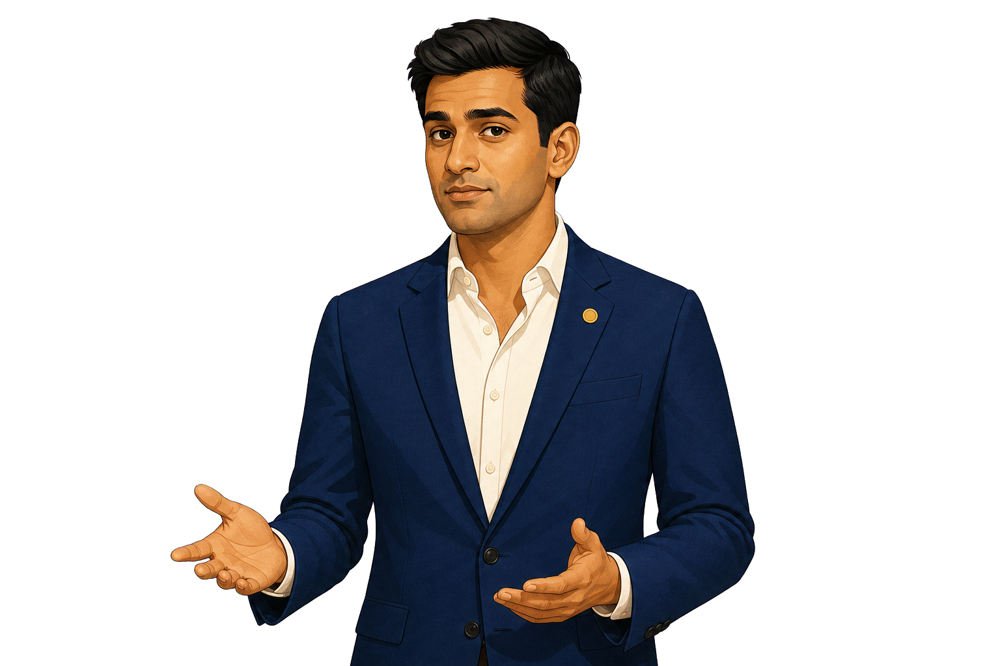
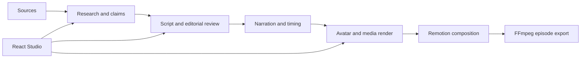

# SynthPost Studio


SynthPost is a local-first, AI-assisted newsroom and video-production system for researching stories, editing scripts and visuals, planning a timeline, rendering an avatar-led composition, and exporting a finished episode. Editorial state and job queues stay on the Mac in SQLite; render inputs and outputs remain inspectable local files.

<p align="center">
  
</p>



## Current capabilities

- Projects, episodes, RSS/Atom sources, discovery, ranking, and assignment desk
- Multi-source research packs with evidence and claims
- Narrative-first structured generation through local Codex/ChatGPT auth or direct Groq/Gemini APIs, with continuity validation, non-rewriting segmentation, manual revisions, and approvals
- Local dots.tts voice-cloned narration with sample-exact beat/section timing shared by timeline, lip sync, and rendering
- Episode-isolated media inbox, SearXNG image/video discovery, rights review, and safe fallbacks
- Editable, validated multi-template timelines
- Local avatar/lip-sync rendering through the retained Avatar Engine, consuming SynthPost's canonical narration
- Remotion composition and FFmpeg episode assembly
- Sidequest storytime-animation production with a procedural recurring cast,
  script-derived scene direction, and approved memory cutaways
- Hermes-powered unattended production from story discovery through a strictly checked, versioned MP4
- React Studio with job progress, logs, retries, previews, and mobile/private Tailscale access
- Configurable multi-process worker pools for parallel projects and episode renders
- Deterministic offline tests and a lightweight `TEST_MODE` smoke render

## System requirements

- macOS on Apple Silicon (primary supported development platform)
- Python 3.11 or newer
- Node.js 20+ and npm
- FFmpeg/ffprobe
- Optional by feature: Docker Desktop (bundled SearXNG), Tesseract, yt-dlp, Blender, Rhubarb, Tailscale

Run `make doctor` after setup for an exact required/optional/configured report.

## Quick start

```bash
git clone https://github.com/Arkane-o7/SynthPost.git
cd SynthPost
cp .env.example .env
make setup
make setup-tts
make doctor
make dev
```

Open `http://127.0.0.1:5173`. For the local ChatGPT-backed path, run
`codex login` and set `SYNTHPOST_LLM_PROVIDER=codex`; no model API key is
needed. Groq and Gemini still use their provider keys. Use
`SYNTHPOST_LLM_PROVIDER=mock` only for tests and smoke/demo runs.

`make dev` starts FastAPI on port 8765, the configured editorial/media/render process pools, and Vite on port 5173. The default capacity is three workers per lane, so independent projects can research, acquire media, render, and assemble concurrently. Tune `SYNTHPOST_EDITORIAL_WORKERS`, `SYNTHPOST_MEDIA_WORKERS`, and `SYNTHPOST_RENDER_WORKERS` in `.env`, then confirm the effective capacity with `make doctor`.

Run components separately with `make backend`, `make workers`, `make worker LANE=render SLOT=1`, and `make web`. SynthPost serializes conflicting stages that target the same story, but narration and visual discovery overlap safely after script approval. Episode assembly cannot overlap work in that episode; unrelated projects and episodes remain parallel.

### YOLO production

Open an episode and choose **YOLO Produce** to hand the full production shift to
Hermes. SynthPost checkpoints every stage in SQLite, applies a green-only media
policy, renders locally, runs strict technical QA, and places the versioned MP4
in the Review Queue. It never uploads: watch the complete MP4 and accept or
reject it manually before publishing to YouTube yourself.

For an overnight run, keep `make dev` and the worker supervisor running. The Mac
may be screen-locked, but it must not enter system sleep; use
`caffeinate -i make dev` when needed. Closing a laptop lid normally suspends the
workers. See [Unattended production](docs/AUTONOMY.md) for setup, gates, and
recovery behavior.

## Basic workflow

1. Create a project and episode.
2. Configure sources and discover or add a story.
3. Select the story and create its research pack.
4. Generate/edit/approve the script.
5. Let script approval queue dots.tts narration and visual discovery; other projects continue in parallel.
6. Review visual media, then generate/edit/validate/approve the sample-timed timeline.
7. Build the renderer manifest and render the avatar/composition.
8. Assemble and review the finished episode.

The Studio exposes these actions in order. The executable stage registry is `pipeline/stages.py`; renderers do not perform hidden editorial work.

## Run the pipeline

For normal work, use the Studio. For a deterministic local smoke:

```bash
make smoke
```

To render an approved manifest directly:

```bash
.venv/bin/python -m pipeline.run_story \
  episodes/<episode_id>/stories/<story_id>/story.json \
  --render-profile preview --skip-avatar-render
```

`TEST_MODE` outputs and placeholder anchors are never production deliverables.

## Generated files

```text
.synthpost/
  synthpost.sqlite3           # authoritative workflow state
  jobs/<job_id>.log           # contextual worker logs
projects/<project_id>/episodes/<episode_id>/media_inbox/
episodes/<episode_id>/
  episode.json
  autonomy_runs/<run_id>/
    final.mp4               # immutable review copy for this run
    final.qa.json           # strict technical QA report
  stories/<story_id>/
    source_documents.json
    research_pack.json
    scripts/
    timelines/
    visuals/
    story.json                # versioned renderer manifest
    preview.png
    composited*.mp4
  final.mp4                   # production output
  final_TEST_MODE.mp4         # smoke output
```

Episode/project data is ignored by Git and is not removed by normal setup or checks.

## Common commands

| Command | Purpose |
|---|---|
| `make help` | Discover the command surface |
| `make setup` | Install Python, Remotion, and Studio dependencies |
| `make setup-tts` | Install dots.tts-MLX and download the local SOAR int4 model |
| `make dev` | Start the full local stack |
| `make backend` / `make workers` / `make web` | Start individual services and the configured worker pool |
| `make searxng-up` / `make searxng-down` | Manage the local SearXNG container |
| `make test` | Run deterministic Python tests |
| `make test-avatar` | Run Avatar Engine unit tests without rendering |
| `make typecheck` | Compile Python and type-check Studio/Remotion |
| `make build` | Build the Studio production bundle |
| `make config-check` / `make doctor` | Validate settings / diagnose local dependencies |
| `make check` | Run the default quality gate |
| `make smoke` | Run the lightweight TEST_MODE render smoke |
| `make smoke-parallel` | Render and assemble two isolated TEST_MODE episodes concurrently |
| `make remote` | Serve the built Studio privately through Tailscale |

## Documentation

- [Architecture](docs/ARCHITECTURE.md)
- [Pipeline](docs/PIPELINE.md)
- [Unattended production](docs/AUTONOMY.md)
- [Configuration](docs/CONFIGURATION.md)
- [dots.tts voice cloning and expression](docs/TTS.md)
- [Sidequest storytime animation](docs/STORYTIME_ANIMATION.md)
- [Development](docs/DEVELOPMENT.md)
- [Troubleshooting](docs/TROUBLESHOOTING.md)
- [Contributing](CONTRIBUTING.md)
- [Avatar Engine](avatar-engine/README.md)

## Safety and compatibility

Visual search results are leads, not proof of usage rights. Yellow-tier media needs explicit manual approval; red-tier media cannot be approved. Secrets belong only in ignored `.env` files and are redacted from structured logs. SQLite migrations, strict boundary models, versioned renderer manifests, and compatibility aliases preserve existing V2 projects while allowing contracts to evolve deliberately.
