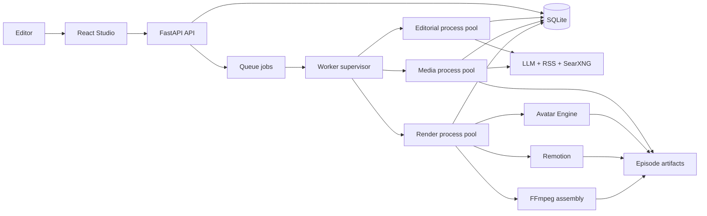
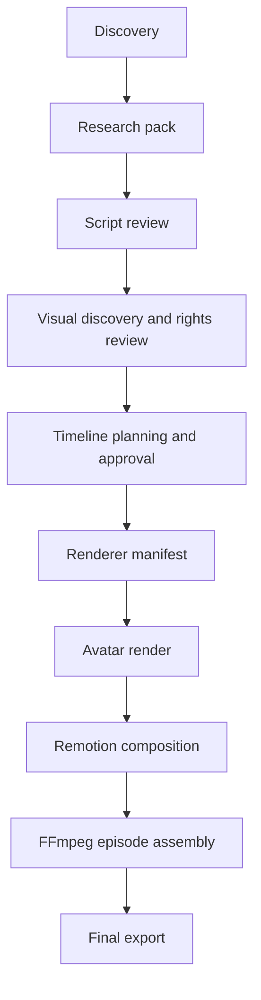

# SynthPost architecture

SynthPost is a local-first modular monolith. SQLite owns editorial workflow state; versioned JSON and media files make render inputs inspectable; three independently sized worker pools isolate editorial, media, and render work while allowing unrelated projects to execute concurrently. The React Studio is a client of the FastAPI API and never accesses SQLite or episode files directly.

## Components and ownership

| Component | Responsibility | Public boundary |
|---|---|---|
| `pipeline/models.py` | Canonical Pydantic domain and persistence models | Strict models reject unknown fields |
| `pipeline/config.py` | Typed environment configuration and compatibility aliases | `get_settings()`, `validate_startup()` |
| `pipeline/stages.py` | Queue stage inputs, outputs, lane, ownership, and run summaries | `STAGE_CONTRACTS`, `contract_for()` |
| `pipeline/db/` | SQLite connection, migrations, and repository operations | `Repository` |
| `pipeline/discovery/` | Source polling, candidate normalization, scoring, assignment desk | Candidate models and repository |
| `pipeline/research/` | Related-source extraction, evidence, claims, research packs | `ResearchPack` |
| `pipeline/llm/` | Structured Groq, Gemini, fallback, and deterministic mock providers | `LLMProvider`, `provider_availability()` |
| `pipeline/scripts/` | Script generation, validation, approval, and deterministic text shaping | `ScriptDocument` |
| `pipeline/visuals/` | Local/SearXNG discovery, download, broadcast-fit and rights review | `VisualSource`, `VisualCandidate` |
| `pipeline/timeline/` | Template registry, timeline planning, and validation | `TimelinePlan` |
| `pipeline/manifest_builder.py` | Approved editor state to renderer manifest | `build_story_manifest()` |
| `pipeline/jobs/` | SQLite queue, supervised process pools, slot leases, retries, cancellation, heartbeat | job type + `StageContract` |
| `pipeline/api/` | HTTP contracts and feature routers | `/api/*` |
| `web/` | Studio presentation, local UI state, typed API client, live job events | `api/client.ts`, `useStudio` |
| `avatar-engine/` | Local TTS/lip-sync/avatar render subsystem | `scripts/run_job.py`, avatar job schemas |
| `compositor/remotion_renderer/` | Timeline/template composition | renderer `story.json` |
| `assembly/stitch_episode.py` | Normalization, intro/outro, episode assembly | episode ID and render profile |

## Control and data flow

The Studio creates jobs through FastAPI. The supervisor starts the configured number of OS processes for each lane; every process leases a numbered capacity slot and claims jobs atomically. The repository excludes jobs that would mutate the same story concurrently and prevents assembly from overlapping work in its episode. Independent projects and episodes remain eligible across every slot. Workers validate output keys against `pipeline/stages.py`, update progress in SQLite, and write project-aware logs under `.synthpost/jobs/`.

Separate processes isolate renderer environment state and native subprocesses. Remotion staging, Avatar Engine media/render caches, story output, and FFmpeg assembly work are episode/story-scoped. Shared first-run brand and Avatar runtime generation uses filesystem locks.

## Domain and contract boundaries

The Python source of truth is `pipeline/models.py`. It contains strict Pydantic models for projects, episodes, sources, story candidates, research packs, scripts, visual candidates, timeline plans, jobs, audits, and artifact records. `contracts/typescript/index.ts` mirrors contracts consumed by the Studio, and `contracts/schemas/synthpost.v2.schema.json` is the canonical cross-runtime JSON Schema checked by tests.

HTTP request contracts live in `pipeline/api/schemas.py`. Patch contracts deliberately exclude identity and timestamp fields. Persisted SQLite JSON is reconstructed through Pydantic in `Repository`, so invalid historical data fails at a named boundary rather than later in a renderer.

Renderer manifests carry `contract_version: synthpost.v2.renderer_manifest`. SQLite uses ordered migrations in `pipeline/migrations/`. Existing rows and unversioned V2 artifact files remain readable; new schema changes must add a migration or compatibility validator before writers change.

## Persistence and generated artifacts

- `.synthpost/synthpost.sqlite3`: authoritative local workflow state.
- `.synthpost/jobs/<job_id>.log`: contextual worker logs; safe to delete when no longer debugging.
- `projects/<project_id>/episodes/<episode_id>/media_inbox/`: editor-owned source media for one episode.
- `episodes/<episode_id>/stories/<story_id>/`: reproducible JSON, selected visual files, avatar output, preview, and composited story.
- `episodes/<episode_id>/final.mp4`: production deliverable.
- `episodes/<episode_id>/final_TEST_MODE.mp4`: smoke/test deliverable; never production.
- `web/dist/` and Remotion build folders: generated build output.

Do not treat episode output folders as source code. The repository ignores them and maintenance commands must not delete user episode/project data.

## Configuration and runtime state

`pipeline/config.py` parses an immutable grouped settings snapshot. Environment variables and `.env`/`.env.local` are configuration. SQLite job progress, selected Studio IDs, caches, and generated files are runtime state. New modules should receive explicit values where practical and otherwise call `get_settings()` at the boundary; do not add direct environment reads to pipeline modules.

## Providers and extension points

Structured language providers implement `LLMProvider.generate_json()` and register in `configured_provider()`. Availability checks must not make a paid/network request. Visual sources implement `VisualSource.available()` and `VisualSource.search()` and register in `configured_visual_sources()` in deterministic precedence order. Provider adapters own credentials, timeouts, normalization, and provider-specific errors; business services own editorial policy.

## Where to add common features

- Domain field or state: `pipeline/models.py`, migration/compatibility reader, JSON Schema, TypeScript contract, tests.
- API operation: request model in `pipeline/api/schemas.py`, feature router (or existing route group), typed method in `web/src/api/client.ts`.
- Pipeline stage: `StageName`/`STAGE_CONTRACTS`, handler, retry classification, API enqueue route, tests, `docs/PIPELINE.md`.
- LLM provider: implement `LLMProvider`, availability check, registry entry, mocked adapter tests.
- Visual provider: implement `VisualSource`, registry entry, rights mapping, offline tests.
- Remotion template: template component, `registry/templates.ts`, Python timeline registry/validation, rendering test.
- Avatar renderer: follow `avatar-engine/AGENTS.md`; preserve protected Blender and compatibility contracts.
