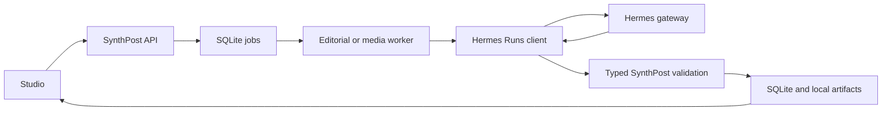

# Hermes newsroom integration

SynthPost can use a separately running local Hermes Agent as a bounded newsroom
engine. SynthPost remains the workflow owner and system of record.

## Current scope

Hermes may perform current story-idea discovery, multi-source research with
claim-to-evidence links, the existing narrative-first structured script stages,
and visual query planning plus real image/video lead aggregation.

SynthPost retains candidate persistence, workflow transitions, strict Pydantic
validation, revision history, editor approval, media downloading, technical
inspection, rights review, Kokoro timing, timeline planning, rendering, and
assembly.

Natural-language episode editing is intentionally deferred. That phase should
expose explicit, reversible SynthPost tools instead of granting arbitrary
database or filesystem access.

## Runtime flow



The browser never calls Hermes. The backend submits `/v1/runs`, polls run state,
propagates cancellation, and validates the final JSON. The API key never appears
in a browser payload.

## Setup

Configure Hermes's API server in `~/.hermes/.env`:

```dotenv
API_SERVER_ENABLED=true
API_SERVER_HOST=127.0.0.1
API_SERVER_PORT=8642
API_SERVER_KEY=generate-a-private-local-key
```

Start it with `hermes gateway start` for the managed background service, or
`hermes gateway run` for a foreground debugging session. Then configure
SynthPost's ignored `.env`:

```dotenv
SYNTHPOST_HERMES_ENABLED=1
SYNTHPOST_HERMES_BASE_URL=http://127.0.0.1:8642
SYNTHPOST_HERMES_API_KEY=the-same-private-local-key

SYNTHPOST_DISCOVERY_PROVIDER=hermes
SYNTHPOST_RESEARCH_PROVIDER=hermes
SYNTHPOST_SCRIPT_PROVIDER=hermes
SYNTHPOST_VISUAL_PLANNER_PROVIDER=hermes
```

Restrict the Hermes API-server profile before enabling SynthPost. The newsroom
integration deliberately accepts only web search/extraction, browser inspection,
vision, and optional video analysis. It refuses terminal, file-write, code
execution, delegation, memory, cron, messaging, and device-control toolsets.
Configure the API Server platform with `hermes tools`, or disable the unsafe
defaults directly:

```bash
hermes tools disable --platform api_server terminal file code_execution image_gen skills todo memory session_search delegation cronjob
hermes gateway restart
```

Run `make doctor`, restart `make dev`, and check Studio Settings. Provider
changes require restarting both API and workers.

## Tool and rights policy

Use a dedicated Hermes profile restricted to newsroom research tools such as web
search, extraction, browser inspection, and vision. Do not enable terminal,
arbitrary file editing, persistent memory, cron, messaging, or autonomous
delegation for this phase.

Hermes source URLs and visual leads are recommendations, not proof of ownership
or a licence. SynthPost always places remote media in manual review.

## Failure and rollback

- Native providers remain the defaults and can be selected independently.
- Cancellation propagates from the SynthPost job to the Hermes run.
- Runs requesting interactive approval fail with an actionable message; the
  dedicated profile should pre-approve only restricted research tools.
- Invalid JSON, unlinked evidence, invalid URLs, and empty results do not advance
  the workflow.
- Up to `SYNTHPOST_HERMES_MAX_CONCURRENT_RUNS` runs execute across all worker
  processes; excess runs wait for a filesystem-backed slot.

To roll back, set all four stage providers to `native`, set
`SYNTHPOST_HERMES_ENABLED=0`, and restart SynthPost. Existing projects and
artifacts require no migration.
