# SynthPost Thumbnail Generator Spec

This spec defines v1 of a local-first thumbnail generator that turns a structured episode brief into 3-5 original SynthPost thumbnail concepts, renders 1280x720 PNG outputs, scores them, and recommends the best variant.

Related files:

- `thumbnail_research_report.md`
- `synthpost_thumbnail_style_guide.md`
- `thumbnail_templates_v1.md`
- `thumbnail_brief.schema.json`

## 1. Generator Goals

The program should:

- Generate 3-5 thumbnail concepts from a JSON brief.
- Pick a recommended best concept.
- Render 1280x720 PNG thumbnails.
- Produce optional A/B variants.
- Explain why each concept should work.
- Reject weak thumbnails before human review.
- Keep SynthPost visually distinct from reference channels.

The generator should not:

- Copy another channel's border, logo, layout, or exact visual identity.
- Invent fake screenshots, fake documents, or fake quotes.
- Use real-person AI likeness generation.
- Use sensational wording unsupported by the episode.

## 2. Input Brief

The input follows `thumbnail_brief.schema.json`.

Minimum useful input:

```json
{
  "video_title": "Nadella Says AI Will Hollow Out Entire Industries",
  "episode_headline": "Satya Nadella warns that AI agents will reshape white-collar work",
  "topic": "AI",
  "main_subjects": [
    { "type": "person", "name": "Satya Nadella", "role": "Microsoft CEO" },
    { "type": "company", "name": "Microsoft" },
    { "type": "object", "name": "AI agents" }
  ],
  "story_angle": "Authority warning about jobs and enterprise automation",
  "emotion": "urgent",
  "assets": {
    "person_images": [],
    "logos": [],
    "background_images": [],
    "maps": [],
    "screenshots": []
  }
}
```

## 3. Output Contract

For each run, output:

```json
{
  "brief_id": "2026-06-23-ai-work-warning",
  "recommended_concept_id": "concept_02",
  "concepts": [
    {
      "concept_id": "concept_02",
      "template_id": "authority_warning",
      "headline_text": "SATYA'S AI WARNING",
      "visual_hook": "Nadella foreground with dim robot-worker grid behind Microsoft campus",
      "assets_used": [],
      "score": 88,
      "score_breakdown": {
        "mobile_readability": 9,
        "subject_clarity": 9,
        "curiosity_gap": 8,
        "emotional_tension": 9,
        "topic_relevance": 9,
        "brand_consistency": 9,
        "visual_contrast": 9,
        "simplicity": 8,
        "title_thumbnail_synergy": 9,
        "premium_feel": 9
      },
      "rationale": "Recognizable authority plus broad industry threat creates a clean click reason.",
      "warnings": [],
      "rendered_png": "episodes/.../thumbnails/concept_02.png"
    }
  ]
}
```

## 4. Recommended Technical Stack

Best v1 choice for this repo: React + Remotion still export, with Python for preprocessing and scoring.

Why:

- The repo already has a Remotion renderer in `compositor/remotion_renderer`.
- React/CSS makes thumbnail templates easy to edit visually.
- Remotion can render deterministic 1280x720 stills and reuse brand components.
- Designers and vibe-coders can iterate on JSX/CSS faster than low-level Pillow coordinates.
- Python remains useful for asset scoring, cutouts, schema validation, and image checks.

Recommended stack:

- Template renderer: Remotion still export from React components.
- Layout definition: typed JSON brief plus template props.
- Asset preprocessing: Python Pillow plus optional ImageMagick.
- Subject cutouts: local `rembg` optional; fallback to masked rectangles if no cutout is available.
- Quality scoring: Python using Pillow, image statistics, optional OCR, optional face/logo detection.
- CLI orchestration: Python module `src/synthpost/thumbnails/cli.py`.

Alternatives:

- HTML/CSS + Playwright: good fallback, but Playwright is not currently installed and Remotion already exists.
- Python Pillow only: deterministic and simple, but slower for rich template iteration.
- SVG templates: good for data graphics, weak for photo-heavy editorial composites.
- Figma-like JSON layout: useful as internal layout data, but not enough by itself.
- Image generation models: useful for abstract backgrounds and symbolic objects, not for real people/logos/news screenshots.

## 5. Pipeline Overview

```mermaid
flowchart LR
  A["thumbnail brief JSON"] --> B["brief validator"]
  B --> C["story analyzer"]
  C --> D["template selector"]
  D --> E["concept generator"]
  E --> F["asset resolver"]
  F --> G["asset preprocessor"]
  G --> H["Remotion renderer"]
  H --> I["quality scorer"]
  I --> J["variant ranker"]
  J --> K["PNG exports + metadata"]
```



## 6. Program Flow

1. Validate brief against `thumbnail_brief.schema.json`.
2. Normalize title, headline, topic, subjects, emotion, and available assets.
3. Extract story signals:
   - Main entity.
   - Conflict pair.
   - Money number.
   - Country/region.
   - Risk/growth polarity.
   - Visual object candidate.
4. Select 3-5 templates.
5. Generate headline text candidates for each template.
6. Resolve assets:
   - Use provided assets first.
   - Search local library second.
   - Use approved web/source providers third.
   - Generate symbolic backgrounds only when needed.
7. Preprocess assets:
   - Crop to face/object focus.
   - Remove or blur background.
   - Normalize color and contrast.
   - Create masks/cutouts.
   - Generate fallback silhouettes/icons if asset quality is weak.
8. Render each concept at 1280x720.
9. Render mobile previews at 320x180 and 160x90.
10. Score and reject weak candidates.
11. Export best candidate plus A/B variants.
12. Write metadata JSON with scoring and rationale.

## 7. Concept Generation Rules

Each concept should contain:

- `template_id`
- `headline_text`
- `subtitle_text` optional
- `main_subject`
- `supporting_subjects`
- `background_prompt_or_asset`
- `colorway`
- `emotion`
- `visual_hook`
- `expected_curiosity_gap`
- `risk_notes`

Headline generation rules:

- 3-5 words preferred.
- 6 words maximum.
- No unsupported claims.
- Use one of the style guide formulas.
- Avoid repeating the title exactly.
- Prefer concrete nouns and active verbs.

Examples:

- Title: "India overtakes South Korea in manufacturing exports"
  - Thumbnail: `INDIA HITS TOP 5`
  - Alternative: `THE FACTORY SHIFT`
- Title: "OpenAI loses market share to Claude and Gemini"
  - Thumbnail: `OPENAI UNDER PRESSURE`
  - Alternative: `CHATGPT'S LEAD SHRINKS`
- Title: "New AI data center deal changes compute economics"
  - Thumbnail: `$40B COMPUTE RACE`
  - Alternative: `THE SERVER BET`

## 8. Template Selection Logic

Topic and angle should drive template choice:

- AI/jobs warning -> `authority_warning`, `agent_swarm`, `industry_shock`.
- Geopolitics -> `map_crisis_marker`, `global_faceoff`, `treaty_deal`.
- Economy/manufacturing -> `factory_boom`, `money_deal_bomb`.
- Company acquisition/funding -> `founder_logo_money`, `deal_board`.
- Platform ban/regulation -> `red_stamp_document`, `map_crisis_marker`, `logo_faceoff`.
- Product/device -> `single_iconic_object`, `device_price_shock`.
- Interview/exclusive -> `authority_triangle`, `inside_the_deal`.
- AI model competition -> `logo_collision`, `model_scoreboard`.

## 9. Asset Sourcing System

Priority order:

1. Assets provided in the episode brief.
2. Episode visual manifest assets already downloaded by the SynthPost pipeline.
3. Local approved library:
   - `assets/thumbnails/people/`
   - `assets/thumbnails/logos/`
   - `assets/thumbnails/backgrounds/`
   - `assets/thumbnails/maps/`
   - `assets/thumbnails/objects/`
4. Existing `src/synthpost/visuals` providers for free/allowed sources.
5. Wikimedia or official brand press kits where licensing allows.
6. Generated symbolic backgrounds, never generated real-person likenesses.

Every external asset should store:

- Source URL.
- License or usage note.
- Download date.
- Asset type.
- Attribution requirement.
- Whether it is safe for thumbnail use.

## 10. Image Preprocessing

### People

- Detect face or use manual focal point from brief.
- Crop to bust/shoulders for authority portraits.
- Remove background if cutout quality is high.
- Add subtle rim light matching story accent.
- Normalize exposure and skin tone gently.
- Reject if source is below 500 px face height for hero use.

### Logos

- Prefer SVG/PNG with transparency.
- Remove white boxes unless the template intentionally uses a card.
- Ensure minimum logo width of 180 px in final canvas.
- Never stretch.

### Backgrounds

- Resize/crop to 1280x720.
- Apply 10-30 px blur if behind text.
- Darken with gradient overlay.
- Add subtle grain/noise.
- Add accent-specific light streak or map/grid overlay only when semantically useful.

### Maps

- Use simplified map shapes.
- Highlight one region or route.
- Use cyan/gold/red linework on dark base.
- Do not cram labels.

### Screenshots/Documents

- Use only real, sourced screenshots/documents.
- Blur unrelated UI.
- Add perspective/card treatment.
- Use `EXPOSED`, `FILED`, `BANNED`, or `RISK` stamps only if true.

## 11. Text Rendering

Renderer should support:

- Main headline with auto-fit.
- Accent word highlighting.
- Optional small source/analysis tag.
- Solid dark or light title plates.
- Stroke/shadow presets.
- Safe-area detection.
- Duration-badge avoidance.

Text auto-fit:

- Start at 96 px.
- Minimum 62 px for main text.
- If text still does not fit, request a shorter headline candidate.
- Reject if main text height is below 48 px.

## 12. Color Grading

Use story emotion to choose grade:

- Urgent: graphite base, red accent, hard contrast.
- Analytical: graphite base, cyan/blue accent, cleaner contrast.
- Shocking: black/red, document/stamp effects.
- Mysterious: dark blue/purple, spotlight, lower saturation.
- Serious: steel gray, blue/cyan, restrained glow.
- Growth: dark green/blue, green or gold data highlights.

All final thumbnails should receive:

- Slight global contrast boost.
- Vignette.
- Mild sharpening after resize.
- Tiny grain pass to unify mixed assets.

## 13. Export Settings

- Canvas: 1280x720.
- Format: PNG for master.
- Optional JPEG copy: quality 92 for upload if file size matters.
- Color space: sRGB.
- File naming:
  - `thumbnail_best.png`
  - `thumbnail_concept_01.png`
  - `thumbnail_concept_01_mobile_320.jpg`
  - `thumbnail_candidates.json`

## 14. Quality Checks

Automated checks:

- PNG exists and is 1280x720.
- No transparent pixels in final output.
- File size under configured max, default 5 MB.
- Main text bounding box inside safe area.
- Main text avoids bottom-right duration badge zone.
- Contrast ratio between text and local background exceeds threshold.
- Downsample preview still readable by heuristic.
- Face/object occupies required minimum area.
- No asset is visibly pixelated beyond threshold.
- No more than configured max logo count.
- No forbidden brand imitation markers.

Manual review prompt:

- "Can you explain the story in one second?"
- "Is the claim supported?"
- "Does the thumbnail look premium at 160x90?"
- "Would this still work with the title hidden?"

## 15. Scoring System: 1-100

The score is a weighted sum of ten dimensions. Each dimension is scored 0-10.

| Dimension | Weight | What it measures |
|---|---:|---|
| Mobile readability | 14 | Main text and subject still clear at 160x90. |
| Subject clarity | 12 | Viewer can identify the main person/logo/object. |
| Curiosity gap | 12 | Thumbnail raises a question the title/video resolves. |
| Emotional tension | 10 | Clear urgency, conflict, warning, opportunity, or mystery. |
| Topic relevance | 10 | Visuals match the actual story, not generic AI imagery. |
| Brand consistency | 9 | Follows SynthPost palette, typography, and premium tone. |
| Visual contrast | 9 | Strong separation of text, subject, and background. |
| Simplicity | 8 | One main idea, limited clutter. |
| Title-thumbnail synergy | 10 | Thumbnail and title complement rather than duplicate. |
| Premium feel | 6 | Finish quality, asset quality, restraint, polish. |

Formula:

```text
score =
  mobile_readability * 1.4 +
  subject_clarity * 1.2 +
  curiosity_gap * 1.2 +
  emotional_tension * 1.0 +
  topic_relevance * 1.0 +
  brand_consistency * 0.9 +
  visual_contrast * 0.9 +
  simplicity * 0.8 +
  title_thumbnail_synergy * 1.0 +
  premium_feel * 0.6
```

### Rejection Thresholds

Reject automatically if:

- Total score below 72.
- Mobile readability below 7.
- Subject clarity below 6.
- Topic relevance below 7.
- Title-thumbnail synergy below 7.
- Main text exceeds 6 words.
- Main claim is unsupported by the brief.
- Critical text falls under the duration badge zone.
- Uses a forbidden copied visual motif.
- Uses an unlicensed or unknown real-person image.

Recommended selection:

- Score 90-100: publish candidate.
- Score 82-89: strong candidate; human review.
- Score 72-81: keep as backup or revise.
- Under 72: reject and regenerate.

## 16. A/B Variant Generation

For each recommended concept, create two optional variants:

- Variant A: stronger text hook, same visual.
- Variant B: alternate visual emphasis, same story claim.

Examples:

- `SATYA'S AI WARNING` vs `AI JOB SHOCK`
- portrait-left layout vs robot-grid background layout
- red alert grade vs cyan analysis grade
- money number prominent vs company logo prominent

A/B variants should not differ in too many dimensions at once. Change one major variable so results can be interpreted.

## 17. Integration Points With Existing Codebase

Existing relevant modules:

- `src/synthpost/visuals/` for planning, providers, validation, and manifests.
- `compositor/remotion_renderer/` for React/Remotion rendering.
- `pipeline/` for episode orchestration.
- `episodes/` for per-episode artifacts.

Recommended new modules:

- `src/synthpost/thumbnails/models.py`
- `src/synthpost/thumbnails/planner.py`
- `src/synthpost/thumbnails/headlines.py`
- `src/synthpost/thumbnails/assets.py`
- `src/synthpost/thumbnails/preprocess.py`
- `src/synthpost/thumbnails/render.py`
- `src/synthpost/thumbnails/scoring.py`
- `src/synthpost/thumbnails/cli.py`
- `compositor/remotion_renderer/src/thumbnail/ThumbnailRoot.tsx`
- `compositor/remotion_renderer/src/thumbnail/templates/*.tsx`
- `compositor/remotion_renderer/src/thumbnail/theme.ts`

## 18. CLI Shape

Proposed commands:

```bash
python -m synthpost.thumbnails.cli validate episodes/ep_x/thumbnail_brief.json
python -m synthpost.thumbnails.cli plan episodes/ep_x/thumbnail_brief.json
python -m synthpost.thumbnails.cli render episodes/ep_x/thumbnail_brief.json --variants 5
python -m synthpost.thumbnails.cli score episodes/ep_x/thumbnails/
python -m synthpost.thumbnails.cli best episodes/ep_x/thumbnails/thumbnail_candidates.json
```

## 19. Acceptance Criteria for v1

The first working generator is acceptable when:

- A valid brief produces at least 3 rendered 1280x720 PNGs.
- The generated metadata includes template ID, headline, assets, score, and rationale.
- At least 10 templates are available.
- Mobile preview files are generated.
- Weak concepts are rejected by automated rules.
- The best candidate is copied or symlinked to `thumbnail_best.png`.
- The result visually follows `synthpost_thumbnail_style_guide.md`.

